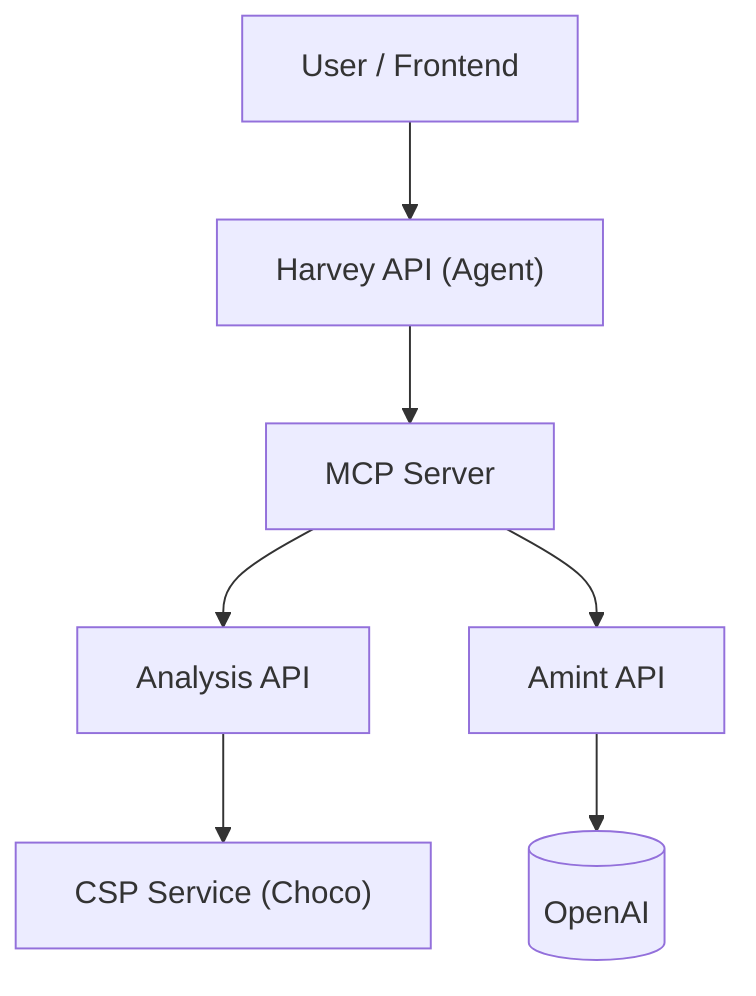

# Pricing Intelligence

Pricing Intelligence is an advanced AI-powered platform designed to analyze, reason about, and extract insights from SaaS pricing models. It combines Large Language Models (LLMs) with rigorous Constraint Satisfaction Problem (CSP) solvers to provide accurate, grounded answers to complex pricing questions. This is part of the contributions of the paper "Pricing Intelligence: Rethinking IS Engineering in Volatile SaaS Environments".

## 🚀 Overview

The system allows users to:
- **Extract** structured pricing models (Pricing2Yaml) from raw website URLs.
- **Analyze** pricing configurations mathematically (validity, feature combinations).
- **Optimize** plan selection based on user requirements (e.g., "Cheapest plan with SSO and 50 users").
- **Interact** via a natural language chat interface powered by the **Harvey** agent.

## 🏗 Architecture

The project is composed of several microservices working in concert:



### Services

| Service | Directory | Description |
|---------|-----------|-------------|
| **Harvey API** | `harvey_api/` | The AI Agent implementing the **ReAct** pattern. It orchestrates tools to answer user queries. |
| **MCP Server** | `mcp_server/` | Implements the **Model Context Protocol**. Exposes tools like `subscriptions`, `optimal`, and `iPricing` to the agent. |
| **Analysis API** | `analysis_api/` | Node.js/TypeScript service. Handles the core logic for pricing analysis, validation, and statistics. |
| **CSP Service** | `csp/` | Java-based service wrapping the **Choco** constraint solver. Performs the heavy mathematical lifting for validity and optimization. |
| **Amint API** | `src/` | Python service responsible for **extracting** pricing data from unstructured sources (URLs) and converting them to the `Pricing2Yaml` format. |
| **Frontend** | `frontend/` | React/Vite application providing the chat interface and visualization. |

## ✨ Key Features

### 🤖 Harvey Agent
Harvey is a specialized agent that follows the **ReAct (Reasoning + Acting)** pattern.
- **Grounding**: It verifies feature names and limits against the actual YAML data before querying tools.
- **Optimization**: Reduces LLM hallucinations by delegating math and logic to the Analysis API.
- **Context Aware**: Can compare multiple pricing models simultaneously (e.g., "Compare HubSpot vs. Salesforce").

### 🛠 MCP Tools
The system exposes several powerful tools via MCP:
- **`iPricing`**: Downloads and structures pricing data from a URL.
- **`subscriptions`**: Enumerates all valid plan configurations given a set of filters.
- **`optimal`**: Finds the best (cheapest/most expensive) configuration satisfying user constraints.
- **`validate`**: Checks if a pricing model is mathematically consistent.
- **`summary`**: Provides high-level statistics about a pricing model.

## 🚦 Getting Started

### Prerequisites
- Docker & Docker Compose
- OpenAI API Key
- **Gemini API Key** (Required for the A-MINT service)

### Installation

1. **Clone the repository**:
   ```bash
   git clone <repository-url>
   cd Pricing-Intelligence
   ```

2. **Configure Environment**:
   Create a `.env` file (or ensure `api_keys.py` / environment variables are set) with your API keys:
   ```bash
   export HARVEY_API_KEY="sk-..."
   export AMINT_API_KEY="sk-..."
   # Note: A-MINT requires a Gemini API Key.
   # For detailed custom instructions, visit: https://github.com/isa-group/A-MINT-repo
   ```

3. **Run with Docker Compose**:
   ```bash
   docker-compose up --build
   ```

### ⚙️ Configuration

#### Changing the OpenAI Model
By default, the Harvey agent is configured to use a specific OpenAI model (e.g., `gpt-5.1`). To switch to a different model (such as `gpt-4o` or `gpt-3.5-turbo`), modify the `OPENAI_MODEL` environment variable in the `harvey-api` service within `docker-compose.yml`:

```yaml
  harvey-api:
    # ...
    environment:
      - OPENAI_MODEL=gpt-4o  # <--- Update this value
      # ...
```

### Accessing the Services

- **Frontend**: http://localhost:5173 (or configured port)
- **Harvey API**: http://localhost:8086
- **MCP Server**: http://localhost:8085
- **Analysis API**: http://localhost:8002
- **Amint API**: http://localhost:8001
- **CSP Service**: http://localhost:8000

## 📝 Usage Example

1. Open the Frontend.
2. Ask a question: *"What is the cheapest plan for Buffer (https://buffer.com/pricing) that includes 10 channels?"*
3. **Harvey** will:
   - Call `iPricing` to extract the model from the URL.
   - Plan an `optimal` search with filters `{"usageLimits": [{"channels": 10}]}`.
   - Return the exact plan name and cost, grounded in the extracted data.

## 📄 License

This project is licensed under the **Creative Commons Attribution 4.0 International (CC BY 4.0)**.
See the [LICENSE](LICENSE) file for details.
